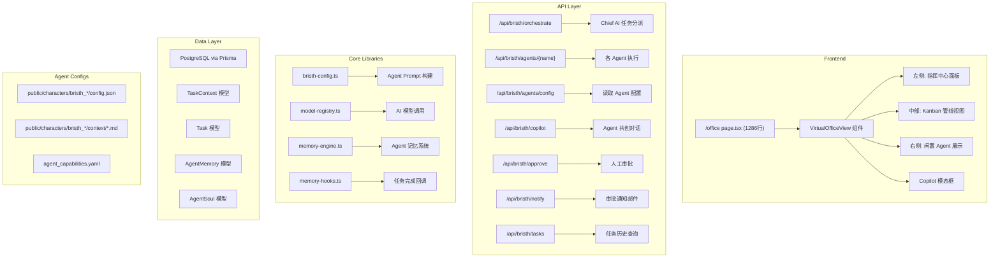
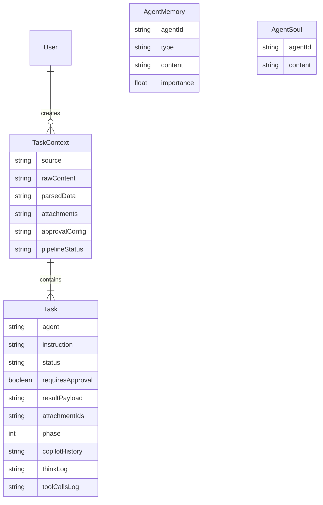

# `/office` 页面 — 自动化办公 Agent 系统架构分析

## 概览

这是一个基于 **Next.js (App Router)** 的多 Agent 自动化办公系统，品牌名称为 **Bristh**。核心理念是用户提交自然语言任务 → Chief AI 编排分派 → 多个专业 Agent 分阶段并行执行 → 人工审批 → 成果交付。

---

## 系统架构图



---

## Agent 清单

| Agent | API 路由 | 角色 | 输出格式 |
|-------|---------|------|---------|
| **Chief** | `/api/bristh/orchestrate` | 总裁特助 / 任务编排器 | JSON (tasks 分派) |
| **Alice** | `/api/bristh/agents/alice` | 方案架构师 | Markdown 文档 |
| **Bob** | `/api/bristh/agents/bob` | 日程安排专员 | ICS 日历文件 |
| **David** | `/api/bristh/agents/david` | 内控纪检专员 | Markdown 文档 |
| **Edda** | `/api/bristh/agents/edda` | PPT 制作专员 | PPTX (slides JSON) |
| **Eric** | `/api/bristh/agents/eric` | 法务写作专员 | Markdown 文档 |
| **Fiona** | `/api/bristh/agents/fiona` | 组织宣发专员 | Markdown 文档 |
| **Grace** | `/api/bristh/agents/grace` | 邮件分发专员 | 邮件内容 |
| **Hugo** | `/api/bristh/agents/hugo` | (有路由) | 待确认 |
| **Iris** | `/api/bristh/agents/iris` | (有路由) | 待确认 |
| **Jarvis** | `/api/bristh/agents/jarvis` | (有路由) | 待确认 |
| **Kelly** | `/api/bristh/agents/kelly` | 文档处理专员 | Markdown + 源文件追踪 |
| **Atlas** | `/api/bristh/agents/atlas` | (有路由) | 待确认 |
| **Nexus** | `/api/bristh/agents/nexus` | (有路由) | 待确认 |
| **Nova** | `/api/bristh/agents/nova` | (有路由) | 待确认 |

---

## 核心流程

### 1. 任务提交与编排 (Orchestration)

```
用户输入 → /new-task 页面 → WorkspaceContext.setPendingDispatchTask()
                             ↓
/office → 检测 pendingDispatchTask → handleDispatch() / handleDispatchWithTasks()
                             ↓
POST /api/bristh/orchestrate → Chief AI 分析意图 → JSON 返回 tasks 数组
                             ↓
Prisma 创建 TaskContext + Task 记录 → 返回前端
```

### 2. 三阶段执行管线 (Phase Pipeline)

| Phase | 名称 | 说明 |
|-------|------|------|
| **Phase 1** | 信息准备 | 文件解析、数据提取、信息结构化 |
| **Phase 2** | 核心工作 | 方案撰写、PPT制作、审计分析、合同起草 |
| **Phase 3** | 整合分发 | 邮件发送 (Grace 始终在此阶段)、最终汇总 |

> **关键机制**: 同一 Phase 内任务并行 (`Promise.all`)，跨 Phase 串行执行。前一阶段的产出 (`priorPhaseResults`) 自动注入到后续阶段 Agent 的上下文中。

### 3. Agent Prompt 构建 ([bristh-config.ts](file:///Users/aisandbox/Documents/myAI/src/lib/bristh-config.ts))

每个 Agent 的 system prompt 由以下部分组成:
1. **Persona** — 来自 `config.json` 的角色设定
2. **Task Instruction** — Chief 分派的具体指令
3. **Raw Context** — 用户原始输入
4. **Private Context** — Agent 专属知识文件 (`context/*.md`)
5. **Soul File** — 积累的经验 (来自 Dreaming Agent)
6. **Recent Memories** — 历史任务中的教训
7. **Attached Files** — 用户上传的附件内容
8. **Prior Phase Results** — 前序阶段其他 Agent 的产出

### 4. 人工审批流程

```
Agent 执行完成 → requiresApproval ? → 状态设为 AWAITING_APPROVAL
                                    ↓
前端显示审批按钮 → 用户点击「批准」→ POST /api/bristh/approve
                                    ↓
所有审批通过 → 自动恢复后续 Phase 的管线执行
              → POST /api/bristh/notify 发送邮件通知
```

### 5. Copilot 共创

完成的任务卡片可点击进入 Copilot 模式:
- **Edda/Iris** → 跳转到 `/toolbox?assetId=` (PPT/可视化编辑器)
- **其他 Agent** → 打开 `DocumentEditorView` 或 Modal 对话框
- 支持多轮对话修改产物，实时预览

---

## 前端 UI 结构 ([page.tsx](file:///Users/aisandbox/Documents/myAI/src/app/%28dashboard%29/office/page.tsx))

> [!WARNING]
> 这是一个 **1286 行的单文件组件**，包含了所有逻辑、状态、渲染。这是最需要重构的点。

### 布局: 三栏结构

| 区域 | 宽度 | 内容 |
|------|------|------|
| **左栏** (指挥中心) | 380px | 任务状态卡片 + Chief 角色卡 + 执行 Log |
| **中栏** (管线视图) | flex-1 | Kanban 式 Phase 列 + Agent 任务卡片 |
| **右栏** (闲置区) | 520px | 未参与任务的 Agent 展示 |

### 渲染预览 (`renderPreview`)

根据 `resultPayload` 的 JSON 结构自动选择渲染方式:
- `fileUrl` → PPT 幻灯片预览 (带翻页)
- `icsContent` → ICS 日历文件代码预览
- `processedFiles` + `content` → Kelly 文档处理结果
- `content` → Markdown 渲染 (Alice/David/Eric/Fiona/Grace)

---

## 数据模型 ([schema.prisma](file:///Users/aisandbox/Documents/myAI/prisma/schema.prisma))



---

## 配置体系

Agent 配置存放在 `public/characters/bristh_{agentId}/`:
- [config.json](file:///Users/aisandbox/Documents/myAI/public/characters/bristh_alice) — 角色信息、persona、技能、启用状态
- `context/*.md` — Agent 专属知识库文件
- [agent_capabilities.yaml](file:///Users/aisandbox/Documents/myAI/public/characters/bristh_chief) — Chief 用来编排的能力字典

通过 `/api/bristh/agents/config` 可 **GET** 所有配置、**PUT** 更新单个配置。

---

## 可能的改进方向

> [!NOTE]
> 以下是基于代码阅读发现的潜在改进点，仅供参考。

1. **page.tsx 拆分** — 1286 行单文件，建议拆为:
   - `CommandCenter.tsx` (左栏)
   - `PipelineKanban.tsx` (中栏)
   - `IdleAgentsPanel.tsx` (右栏)
   - `CopilotModal.tsx` (Copilot 弹窗)
   - `useOfficeDispatch.ts` (dispatch hook)

2. **`handleDispatch` 与 `handleDispatchWithTasks` 重复代码** — 两个函数有大量相同的 `executeAgent` 逻辑，可抽取为共用函数

3. **Demo 硬编码** — [orchestrate/route.ts L122](file:///Users/aisandbox/Documents/myAI/src/app/api/bristh/orchestrate/route.ts#L122-L132) 中有 `Global Edu Group` 的硬编码管线，应考虑移除或配置化

4. **`input` 变量未定义** — [page.tsx L832](file:///Users/aisandbox/Documents/myAI/src/app/%28dashboard%29/office/page.tsx#L832) 引用了 `input` 变量但组件中未声明

5. **记忆系统集成** — AgentMemory 和 AgentSoul 模型已就位，已在 prompt 构建中注入
